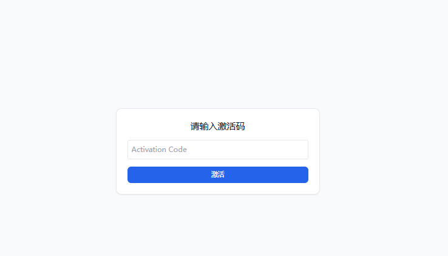

# Bank Quiz App
# 银行客服经理刷题网站

一个轻量级、零后端的银行客服经理考试刷题 Web 应用。基于 **React 18 + TailwindCSS + framer-motion** 构建，静态化部署到任意 CDN（Vercel / Netlify / Gitee Pages / OSS 等）。支持章节练习、成绩统计、错题本、多选题 / 判断题渲染等功能，手机 & 桌面双端友好。



---

## 功能特性

| 模块    | 说明                                |
| ----- | --------------------------------- |
| 章节练习  | 题库按章节分类，一键切换                      |
| 多题型渲染 | 单选 / 多选 / 判断 自适应 UI               |
| 成绩统计  | 本地 `localStorage` 持久化，总成绩 & 分章节成绩 |
| 错题本   | 错题与题库解耦，独立存储，可一键移除已纠正题            |
| 上一题 / 提交 / 下一题   | 题卡下方新增“上一题”按钮，可随时回顾前一题            |
| 激活码登录  | 用户需输入激活码方能进入刷题；每位用户对应唯一激活码，数据存储独立互不影响          |
| 动效体验  | framer-motion 进场动画、按钮微缩放          |
| 响应式   | Tailwind utility class，移动端体验佳     |
| 零后端   | 纯静态文件，可放任何静态托管平台                  |

---

## 目录结构

```
quiz-app/
├─ public/            # index.html + 题库 JSON（会被 fetch）
├─ src/
│  └─ QuizApp.jsx     # 主入口（如使用 CRA 可放 src/App.jsx）
├─ style.css          # Tailwind 指令入口
├─ tailwind.config.js # Tailwind 配置
├─ postcss.config.js  # PostCSS 配置（Vercel 必需）
└─ package.json
```

### 题库文件

```
public/
 ├─ single.json  # 单选题
 ├─ multi.json   # 多选题
 └─ judge.json   # 判断题
```

每道题结构示例：

```json
{
  "id": 1,
  "chapter": "存款与结算业务",
  "text": "境内个人从储蓄账户向已出境外汇经常项目支出时，银行可直接办理的汇出金额( )以内。",
  "options": ["A选项", "B选项", "C选项", "D选项"],
  "answer": 0,
  "note": "如需备注可写在这里"
}
```

* **单选/判断**：`answer` 为数字索引
* **多选**：`answer` 为数组，如 `[0,2,3]`

---

## 快速开始

```bash
# 1. 安装依赖
npm install
# 2. 本地开发
npm start      # http://localhost:3000/
# 3. 生产构建
npm run build  # 生成 build/ 目录
```

> 若使用 **PNPM/Yarn**，命令自行替换。

---

## 部署

### Vercel

1. 将代码推送至 GitHub/GitLab
2. Vercel Dashboard → Import → 选择仓库
3. Framework Preset 选 **Create React App** 或 **Other**
4. Build Command `npm run build`，Output Dir `build`
5. Deploy → 获得 `*.vercel.app` 域名

> 国内无法直连 `vercel.app` 可用：
>
> * 反向代理到自有服务器
> * Gitee Pages / OSS 静态托管

### Gitee Pages（国内加速）

```bash
npm run build
zip -r dist.zip build/
```

上传 `build` 文件夹到 Gitee Pages 即可。

---

## 自定义

* **修改样式**：直接编辑 `style.css` / Tailwind class
* **新增题库**：在 `public/` 目录放置新的 JSON 并在 `FILES` 数组里注册
* **深色模式**：浏览器 `prefers-color-scheme` 自动生效，也可手动添加切换按钮

---

## TODO

* 多选题选项修正
* 添加上一题功能
* 修复点入章节返回会导致做题进程刷新
* 题目搜索 & 过滤
* 进度条 / 做题倒计时
* PWA 离线缓存 & 桌面安装
* 国际化（i18n）

---

## License

[MIT](LICENSE)
